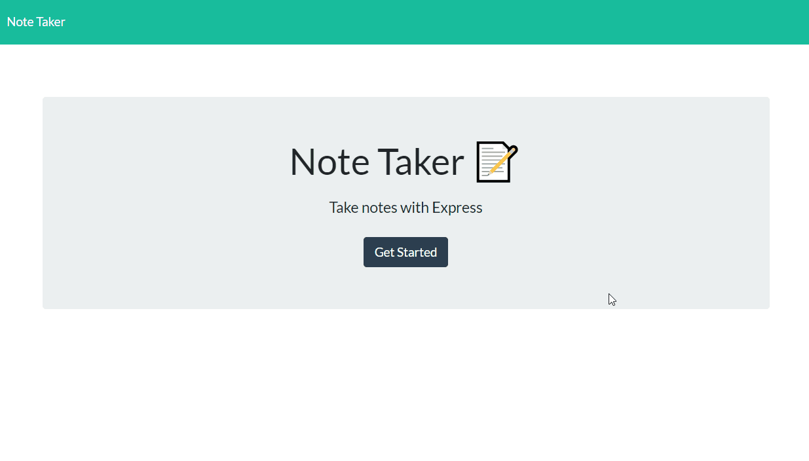

# adrianos-note-taker-11

Homework 11 - Express.js Note Taker

## GitHub Repository 🚀

- [GitHub Repo Link](https://github.com/AdrianoArmen/adrianos-note-taker-11)

## Heroku Deployment 📦

- [App Deploy Link](https://evening-ocean-90274.herokuapp.com/)

## Project Description 📋
This simple note-taking application was designed with provided front-end code. It is designed to showcase my knowledge of [Express.js](https://expressjs.com/es/) servers combined with JSON file processing to fetch and retrieve desired data by routing. The back-end code was developed with the expectation of deploying the final app on [Heroku](https://heroku.com/). Middleware concepts were essential to build the app functionality as well as [UUIDv4](https://www.npmjs.com/package/uuidv4) implementation for id data.

## Mock-Up 🔍

The following images show the web application's desired appearance and functionality: 

## App Functionality 💾

The following animation demonstrates the actual application functionality:

## Technologies used 🛠️

- [Express.js](https://expressjs.com/es/) - server built
- [Heroku](https://heroku.com/) - application deployment
- [UUIDv4](https://www.npmjs.com/package/uuidv4) - unique id generation
- [NPM](https://www.npmjs.com/) - package manager
- [File System module](https://nodejs.org/api/fs.html) - directory navigation

## License 📄

This project is licensed under the MIT License - see the [LICENSE.md](LICENSE.md) file for details

---

© 2021 Adriano.
